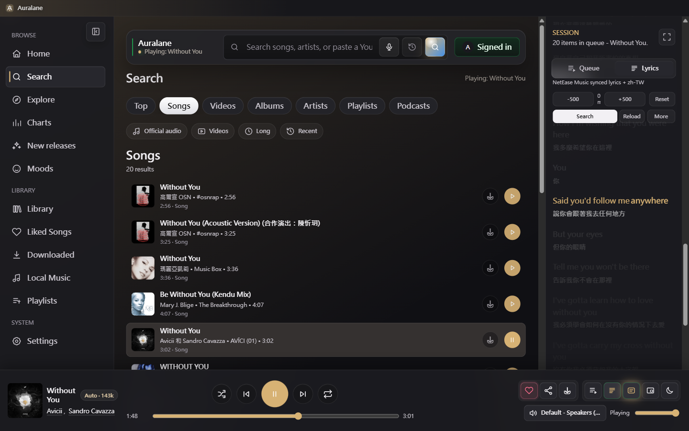
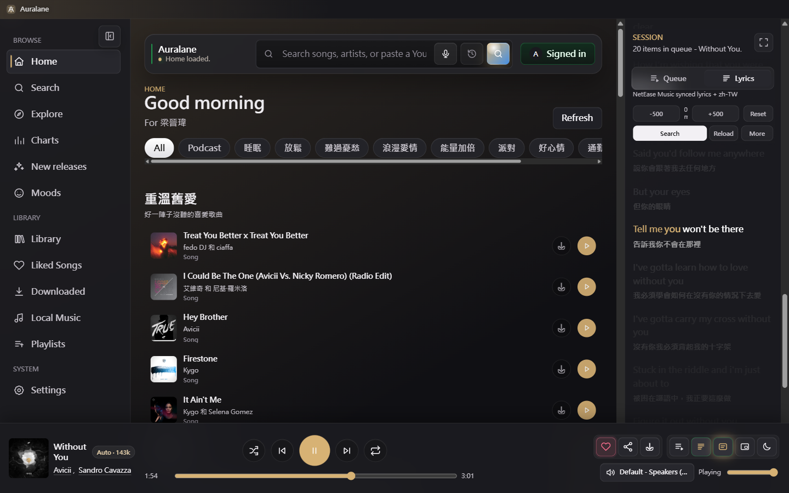
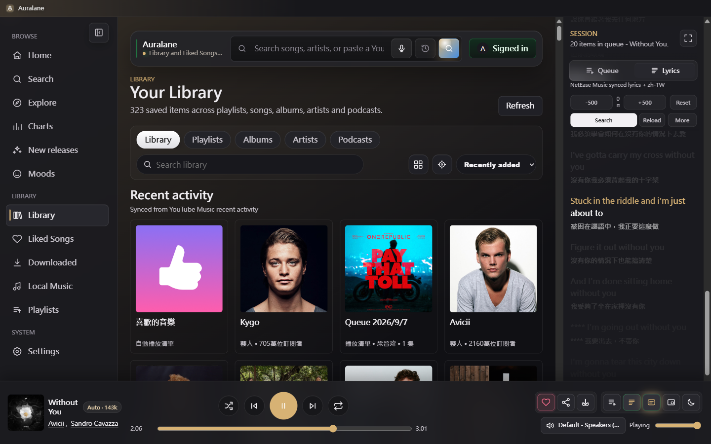
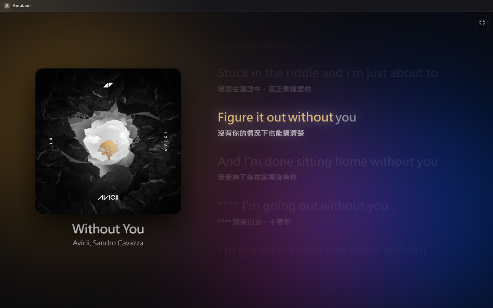
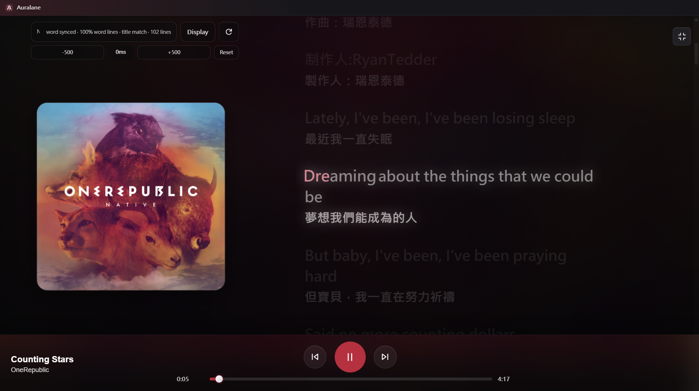
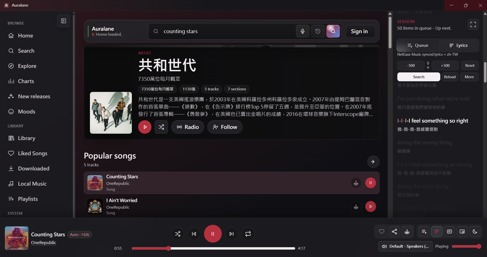
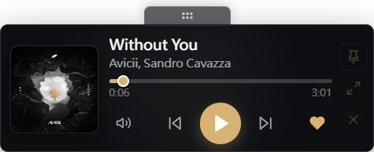
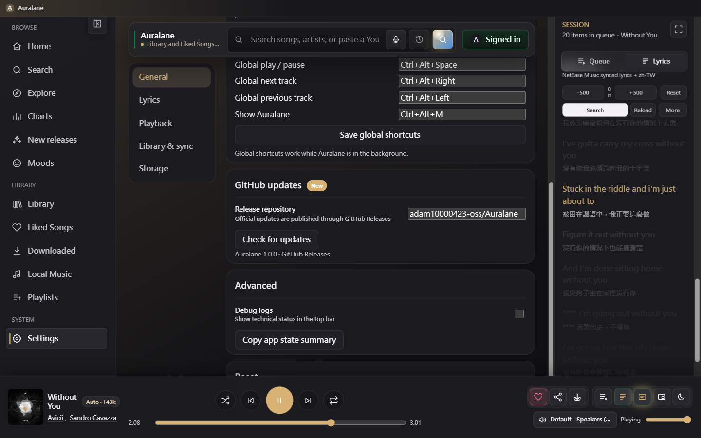

# Auralane

Auralane is a desktop music player for YouTube Music, built with Electron. It combines discovery, queue management, local music, offline playback, synchronized lyrics, translation, desktop lyrics, and compact player experiences in one focused interface.

> Auralane is an independent, unofficial client. It is not affiliated with or endorsed by Google or YouTube.

## Download

| Platform | Package | Notes |
| --- | --- | --- |
| Windows | [Installer (`Setup.exe`)](https://github.com/adam10000423-oss/Auralane/releases/latest) | Recommended. Supports automatic updates. |
| Windows | [Portable (`.exe`)](https://github.com/adam10000423-oss/Auralane/releases/latest) | Runs without installation. |
| macOS Apple silicon | [DMG / ZIP](https://github.com/adam10000423-oss/Auralane/releases/latest) | For M-series Macs. |
| macOS Intel | [DMG / ZIP](https://github.com/adam10000423-oss/Auralane/releases/latest) | For Intel Macs. |

Unsigned macOS builds may require using **Open** from Finder's context menu on first launch. Release files and checksums are published on the [latest release page](https://github.com/adam10000423-oss/Auralane/releases/latest).

## Interface

### Search and synchronized lyrics



### Home and personal discovery



### Library



### Full-screen lyrics



Full-screen lyrics support word-by-word highlighting, translated lines, per-track timing adjustment, source switching, display controls, and artwork-reactive colors.



### Artist pages and Session lyrics

Artist profiles combine biography, popular songs, radio, follow controls, and direct playback. The resizable Session panel keeps Queue and Lyrics available beside the current page.



### Compact desktop playback

| Mini player | Desktop lyrics |
| --- | --- |
|  |  |

### GitHub updates



## Features

### Music discovery and playback

- Search songs, videos, albums, artists, playlists, and podcasts.
- Filter search results by media type, official audio, video, duration, and recency.
- Browse Home, Explore, Charts, new releases, moods, and genres.
- Open artist, album, playlist, and podcast pages without leaving the player.
- View artist biographies, popular tracks, related releases, radio, and follow state.
- Direct audio playback with YouTube Music web fallback when required.
- Play, pause, seek, skip, shuffle, repeat, start radio, and restore the previous playback session.
- Queue reordering with drag preview and edge auto-scroll, plus play next, add to queue, and queue lock.
- Playback quality selection, output-device selection, crossfade, gapless playback, ReplayGain, and silence skipping.
- Configurable audio equalizer and output-device switching.
- Media keys, system tray controls, global shortcuts, notifications, and a sleep timer.
- Theme colors can follow the current song artwork.

### Lyrics

- Plain, line-synchronized, and word-synchronized karaoke lyrics.
- Lyrics sources include NetEase Music, Musixmatch, BetterLyrics, LRCLIB, KuGou, Paxsenix, LyricsPlus, Lyrics.ovh, and YouTube transcripts.
- Search enabled providers in parallel, compare versions, preview results, and remember the selected source per song.
- Per-song timing offset with `-500 ms`, `+500 ms`, and reset controls.
- Timeline editing and tap timing for correcting synchronized lyrics.
- Fast translation with cached results, romanization, editable translated lines, and configurable target language.
- Word-level karaoke coloring follows the exact active word when timing data is available.
- Full-screen focus lyrics with song artwork, alignment and display controls, source selection, and auto-follow.
- Session lyrics remain scrollable and can return to the current line with the Sync control.
- Always-on-top desktop lyrics stay synchronized when the main window is minimized or hidden.
- Share selected lyrics as a generated image card.
- Lyrics keep following playback even when the Session panel is hidden.

### Library, playlists, and offline use

- YouTube Music liked songs, playlists, albums, artists, history, and subscriptions.
- Like or unlike tracks directly from lists and the player.
- Create and manage local playlists, open saved YouTube Music collections, and start playback from any track.
- Sort and filter liked songs, downloads, playlists, and local music.
- Download individual tracks or full collections from supported pages.
- Download manager with pause, resume, retry, progress reporting, and failed-item cleanup.
- Offline cache, configurable cache size, and offline-only playback.
- Local music folder scanning, metadata and cover extraction, filtering, sorting, playback, and full-library reset.
- Smart playlists, listening history, backup import/export, and layout restore.

### Desktop experience

- Collapsible, scrollable sidebar with aligned compact and expanded layouts.
- Resizable Session panel with Queue and Lyrics tabs and remembered width.
- Compact mini player with playback controls and an external drag handle that does not resize the player.
- Always-on-top desktop lyrics with synchronized translation, word timing, adjustable opacity, and font selection.
- Full-screen listening mode with artwork-reactive visuals and uncluttered transport controls.
- Multiple density options and a theme that can automatically follow the current song artwork.
- English, Traditional Chinese, Simplified Chinese, Japanese, and Korean interface languages.
- Account profile switching and secure local session storage through the operating system.
- Automatic GitHub Release checks. The installed Windows build downloads, installs, and reopens a new version after one click on **Update now**.

## Run from source

Requirements:

- Node.js 22 or newer
- npm 10 or newer

```powershell
git clone https://github.com/adam10000423-oss/Auralane.git
cd Auralane
npm install
npm start
```

The bundled local translation runtime and language models are optional release components and are not stored in Git because of their size. Source builds automatically use available online translation providers when the local runtime is absent.

## Build packages

```powershell
npm ci
npm test
npm run dist
```

Build output is written to `dist/`. Windows produces an NSIS installer and a portable executable. macOS packages are built on macOS runners for both Intel and Apple silicon.

Creating a tag such as `v1.0.1` triggers the GitHub Actions release workflow and publishes the update metadata required by `electron-updater`.

## Privacy and security

- The renderer uses context isolation, sandboxing, and no Node.js integration.
- Embedded web playback is restricted to `music.youtube.com`.
- External navigation is limited to HTTPS and opens outside the app.
- Session cookies use Electron `safeStorage`; Auralane does not persist them when secure OS storage is unavailable.
- Account data, queues, downloads, local file paths, lyrics caches, and playback history remain on the local device.
- CI checks production dependencies and runs the project test suite for releases and pull requests.

See [SECURITY.md](SECURITY.md) for responsible vulnerability reporting.

## Documentation

- [Detailed user guide](USER_GUIDE.md)
- [Release history](https://github.com/adam10000423-oss/Auralane/releases)
- [Issue tracker](https://github.com/adam10000423-oss/Auralane/issues)

## License

[MIT](LICENSE)
